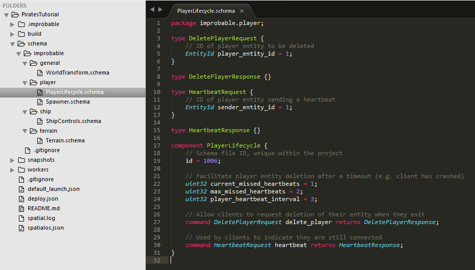
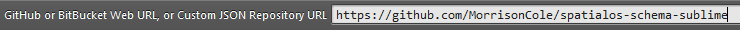
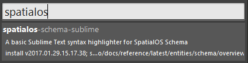

# SpatialOS Schema Sublime
A basic Sublime Text syntax highlighter for [SpatialOS Schema](https://spatialos.improbable.io/docs/reference/latest/entities/schema/overview).

## Installation
Using Sublime [Package Control](https://packagecontrol.io/), you can add this repository as a package source, and install it directly
from the editor.

1. Install [Package Control](https://packagecontrol.io/installation)
2. Follow the instructions to [add a repository](https://packagecontrol.io/docs/usage) and enter
https://github.com/MorrisonCole/spatialos-schema-sublime as the source:

3. Follow the instructions to [add package](https://packagecontrol.io/docs/usage) and choose `spatialos-schema-sublime`:

4. Open a SpatialOS Schema file (`.schema`)

_Note:_ you may have to restart Sublime in order for the correct syntax highlighting to be
applied. If it isn't, to go `View`-> `Syntax` in the toolbar and ensure `SpatialOS Schema` is checked.

## The State of This Repository

I hacked this together on a weekend. As such, it might not work very well.

## Contributing

Feel free to submit a pull request if you fancy making any improvements!
